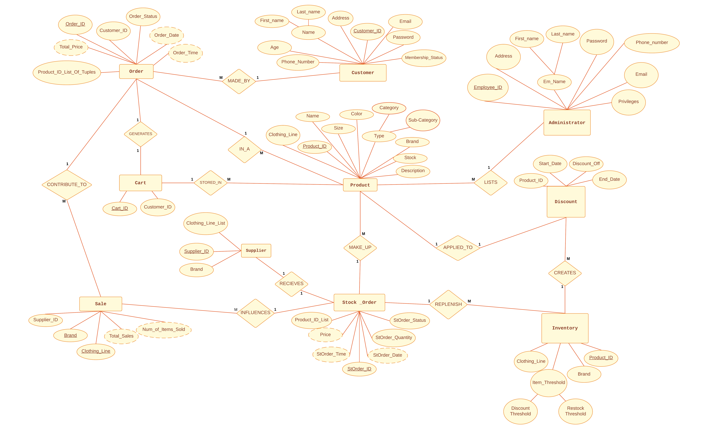

# COSC3380-TeamProject
# Point-of-Sale (POS) Web Application

Project Team (8): Frank Landry, Jacob Bachtarie, Sakeyna Abdul-Aziz, Dinh Thinh Ngo, Leonel Mata

Domain knowledge:
- The Point of Sale (POS) database includes users, inventory and sales data. This data is very important and dynamic, as users could analyze it and track the sales over a certain period of time to see business performance as well as maintain inventory and re-stock if necessary.
- It is crucial to have all functionalities of the database to integrate seamlessly while still providing a user-friendly interface to extract reports and analytics for customers.

Domain of Discourse (Miniworld):
- The database represents an online brand-oriented clothing store.
- The multi-brand online clothing store sells different articles of clothing, accessories, and shoes for any kind of customer, men, women, and kids. Customers may browse item categories, perform a search for their desired clothing items, and even filter search results. They can choose the size, color, and quantity of the item before adding it to their cart. Customers are able to view their shopping cart, edit and delete items from the cart, and view their subtotal. They also get notified if an item from their cart has changed in price or gone out of stock. The website is managed directly by employees, who can add or remove items as needed. Customers may also have the option to be notified about out-of-stock items once they return.
- The website keeps track of how much stock it has to sell from each brand. All clothing items belong to specific brands that the store is authorized to distribute.
- Website also tracks which brands, clothing lines, size’s are selling the most to further determine the demographic of users to be targeted. 

Entity Categories:
1. Product
    - Product ID
    - Name
    - Color
    - Size
    - Stock
    - Description
    - Category (ex. shirt)
    - sub-Category (ex. short-sleeve, long-sleeve)
    - Brand

2. Customer
    - Name (First, Last)
    - Customer ID
    - Phone Number
    - Address
    - Email
    - Password
    - Membership status
    - Age

3. Admin
    - Name (First, Last)
    - Employee ID
    - Phone Number
    - Email
    - Password
    - Privileges

4. Order
    - Order ID
    - Customer ID
    - Price
    - Order Status
    - Order Date
    - Order Time
    - Product list of tuples (Product_ID, Quantity)

5. Stock Order
    - StOrder ID
    - StOrder Quantity
    - Price
    - StOrder Status
    - StOrder Time
    - StOrder Date
    - Product ID list

6. Inventory
    - Item Threshold (Discount, Restock)
    - Brand (ex. Nike, Gucci)
    - Clothing line(ex. Nike Pro)
    - Product ID

7. Shopping Cart
    - Cart ID
    - Customer ID

8. Supplier/Item Source
    - Supplier ID
    - ClothingLine_list
    - Brand

9. Sale(can be merged with supplier if needed)
    - Brand
    - total_sales($)
    - #_of_items_sold
    - total_cost_of_inventory(how much has been bought from supplier)

10. Discount
    - Product ID
    - Discount_off(%)
    - Quarter/year (Q1/22)
    - Sales Threshold

- Relationships:
    - Orders MADE_BY Customer (M:1)
    - Multiple Products IN_A Order (M:1)
    - Orders CONTRIBUTE_TO Sales (M:N)
    - Orders RECEIVE Discounts (1:M)
    - Products STORED_IN Cart
    - Cart CREATES Orders
    - Admin CREATES Products

- Constraints:
    - Product stock cannot be negative
    - Only one unique cart per customer account
    - Orders have unique ID numbers
    - Two products can’t have the same ID number
    - Customer accounts can’t modify or create products
    - Users can’t make orders or have a cart
    - Customers can’t access orders and carts of other customer

- Conceptual Schema
    - A map of the concepts, entities, and relationships laid out for this database can be seen in the image below.
    
   
------------------------------------
The website uses HTML and PHP, and PostgreSQL is used for the database. To connect to the database, files connect.php and db_connect.php use the specific hosted address (the website is hosted through AWS and the database is hosted through Microsoft Azure) as well as preset username, password, and port number. For any similar database, these values could be replaced and used to connect elsewhere. 

The listings page shows all the items available for purchase in the database, with an image assigned to each item. These images are stored in the product_img folder. The itemadd page (in the staff portal) lets you attach an image to new products, and this image is renamed to match the product id number of the associated product, before being saved to the product_img folder to be accessed by listings.
